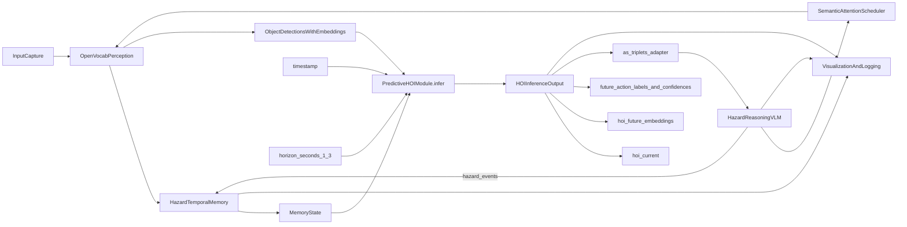
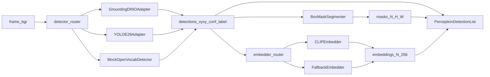
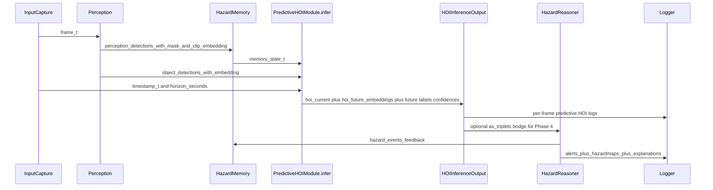
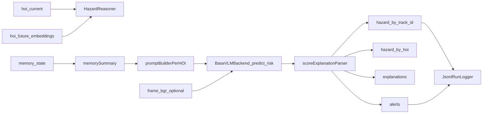
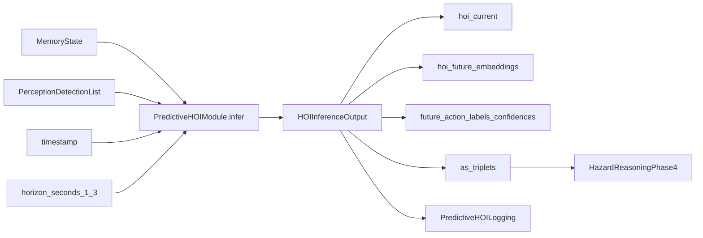
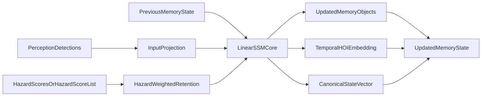
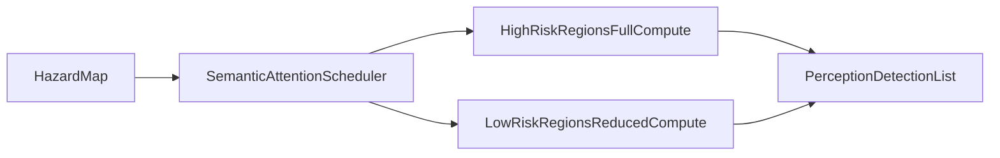

# RiskSense-VLA Architecture

## Project Scope

RiskSense-VLA is a modular Vision-Language-Action stack designed for laptop-class real-time inference (Apple M-series default, CUDA/TensorRT optional) and reproducible research workflows.

## What Is Novel Beyond Model Stacking

1. **Hazard-aware memory**: risk-weighted persistence where high-risk entities decay slower.
2. **Predictive HOI embeddings**: 1-3 second anticipatory HOI trajectory prediction.
3. **Semantic attention scheduler**: compute allocation favors high-risk regions for edge efficiency.
4. **New metrics**: THC (temporal HOI consistency), HAA (hazard anticipation accuracy), RME (risk-weighted memory efficiency).

## Module Graph




## Perception Backend Routing

`OpenVocabPerception` now uses a config-driven detector + embedder router and emits
a canonical `list[PerceptionDetection]` contract for downstream modules.



### Perception Config Surface

Primary keys in `configs/default.yaml` and backend overrides:

- `perception.detector_backend`: `grounding_dino` | `yoloe26` | `mock`
- `perception.embedder_backend`: `clip` | `clip_or_fallback` | `fallback`
- `perception.detector_confidence_threshold`
- `perception.detector_text_threshold`
- `perception.detector_max_detections`
- `perception.clip_model_id`
- `perception.clip_batch_size`
- `perception.default_labels`

### Resilience/Fallback Behavior

- Mock detector fallback is disabled by default and only allowed when `perception.allow_mock_backend=true`.
- If CLIP embedding is unavailable, `clip_or_fallback` mode automatically switches to histogram-based fallback embeddings.
- Output contract for downstream consumers:
  - detections: `list[PerceptionDetection]`
  - each detection carries `bbox_xyxy`, `mask`, and `clip_embedding`


## Temporal Flow



## Phase 4 Hazard Reasoner

The hazard reasoner is now prompt-driven and backend-pluggable under
`src/risksense_vla/hazard/`.

- `HazardReasoner(backend, config)` is the canonical implementation.
- `DistilledHazardReasoner` remains as a backward-compatible wrapper.
- Backends:
  - `Phi4MultimodalBackend` (default Phase-4 backend)
  - `TinyLocalVLMBackend` (lightweight mode only)
  - `StubBackend` (lightweight mode only)

### Hazard Reasoning Flow



### Prompt Structure

For each HOI, the reasoner builds a structured prompt with:

- memory summary (persistence, hazard history, age, motion placeholder)
- current interaction (`subject`, `action`, `object`, confidence, predicted flag)
- proximity-derived risk factors from memory object geometry

The backend response is parsed into:

- `risk_score` in `[0, 1]`
- short natural-language explanation

### Hazard Config Surface

Primary `hazard:` keys in `configs/default.yaml`:

- `backend_type`: `phi4_mm` (default) or `tiny`/`stub` when `lightweight_mode=true`
- `max_tokens`: generation cap (default `64`)
- `temperature`: decode temperature (default `0.2`)
- `lightweight_mode`: enable tiny/stub lightweight backends
- `phi4_model_id`, `phi4_precision`, `phi4_estimated_vram_gb`
- `explain`: explanation text toggle
- `debug_prompt`: include prompts in logs
- `reasoner_checkpoint`, `reasoner_fallback_mode`, `alert_threshold`

### Runtime Logging Extensions

Per-frame logging now includes hazard-specific fields in addition to existing frame data:

- `hazard_map` (track-id keyed)
- `hazard_map_legacy` (`subject:action:object` keyed)
- `hazard_explanations` (track-id keyed)
- `hazard_prompt_debug` (optional prompt text)
- `hazard_inference_ms`
- `hazard_backend`
- `hazard_backend_metadata`

## Phase 3 Predictive HOI Module

The Phase 3 Predictive HOI module is implemented in `src/risksense_vla/hoi/hoi.py` with a new inference API:

- `PredictiveHOIModule.infer(memory_state, object_detections, timestamp, horizon_seconds=None) -> HOIInferenceOutput`

Inputs:

- `memory_state`: `MemoryState` from hazard-aware temporal memory
- `object_detections`: `list[PerceptionDetection]` with per-object `clip_embedding`
- `timestamp`: frame timestamp in seconds
- `horizon_seconds`: optional override for 1-3 second prediction horizon

Outputs (`HOIInferenceOutput`):

- `hoi_current`: current frame HOIs (`subject`, `action`, `object`, `confidence`, `t_start`, `t_end`)
- `hoi_future_embeddings`: predictive tensor shaped `[num_objects, horizon_seconds, emb_dim]`
- `future_action_labels`: predicted action labels per object per horizon step
- `future_action_confidences`: confidence tensor `[num_objects, horizon_seconds]`
- `as_triplets()`: adapter for downstream hazard reasoner integration in Phase 4




## Memory Update Flow



### Implemented Linear SSM Memory

`HazardAwareMemory` now uses a pure-PyTorch linear SSM update in
`src/risksense_vla/memory/hazard_memory.py`:

- Sequential recurrent update: `x_t = A*x_{t-1} + B*u_t`
- Hazard gating increases retention for high-risk entities
- Complexity remains linear in active detections and tracked objects
- `state_vector` stores compact memory stats plus temporal embedding/SSM slices for downstream use

### Memory API Surface

Both runtime and explicit state-in/state-out flows are supported:

- Stateful update:
  - `HazardAwareMemory.update(timestamp, detections, hazards=None, hazard_events=None, previous_memory_state=None, log_callback=None) -> MemoryState`
- Functional update:
  - `update_hazard_memory(timestamp, detections, previous_memory_state, hazards=None, hazard_events=None, log_callback=None) -> MemoryState`

`hazards` is optional and aligned per detection. If omitted, memory defaults to full observation confidence (`1.0`) unless `hazard_events` are provided.


## Semantic Attention Allocation




## Typed Module Contracts

Core inter-module payloads are defined in `src/risksense_vla/types/schema.py`:

- `FrameData`
- `PerceptionDetection`
- `HOITriplet`
- `HazardScore`
- `MemoryState`

This keeps ablation swaps and backend-specific model replacements stable.

## Latency Budgets (Phase 1)

- Perception <= 50 ms/frame
- Memory <= 5 ms/frame
- HOI <= 20 ms/frame

## Logging Schema (JSONL)

Each frame record includes:

- `frame_id`, `timestamp`
- `detections`, `hois`, `hazards`
- `hazard_map`, `hazard_map_legacy`
- `hazard_explanations`
- `hazard_prompt_debug` (when enabled)
- `hazard_inference_ms`, `hazard_backend`
- `memory_stats`
- `latency_ms`
- `attention_allocation`
- `alerts`

Perception-only diagnostics are logged separately by:

- `scripts/run_perception_smoke.py` -> `outputs/perception_smoke.jsonl`
- `scripts/eval_perception_fps.py` -> `outputs/perception_fps.json`
- `scripts/run_memory_example.py` -> stdout per-frame memory summaries (`--log`)
- `scripts/eval_memory_fps.py` -> `outputs/memory_fps.json`

## Module Responsibility Table

| Module | Directory | Responsibility |
|--------|-----------|----------------|
| **io** | `io/` | Video capture from camera/file, FPS pacing, multi-view support |
| **perception** | `perception/` | Open-vocab detection (GroundingDINO/YOLOE), CLIP embedding, mask segmentation |
| **memory** | `memory/` | Hazard-aware SSM temporal state, object persistence tracking |
| **hoi** | `hoi/` | Current HOI recognition and 1-3s future HOI prediction |
| **hazard** | `hazard/` | VLM-based hazard scoring with pluggable backends, alert generation |
| **attention** | `attention/` | Semantic compute allocation based on hazard risk |
| **eval** | `eval/` | Metrics (THC/HAA/RME), ablation framework, plotting |
| **viz** | `viz/` | Overlay rendering and JSONL run logging |
| **train** | `train/` | Training loops, QAT/PTQ quantization, TorchScript/ONNX export, benchmarking |
| **runtime** | `runtime/` | Backend selection (MPS/CUDA/CPU) and device routing |
| **types** | `types/` | Shared dataclasses and inter-module data contracts |
| **config** | `config.py` | YAML loading, merging, validation, typed accessors |
| **synthetic** | `synthetic/` | Procedural hazard scene generation for training data |

## ASCII System Diagram

```
                        +-----------+
                        |  Config   |
                        | (YAML)    |
                        +-----+-----+
                              |
                              v
+--------+    +-----------+   +-----------+   +----------+   +---------+
| Camera |    | Video     |-->| Open-Vocab|-->| Hazard   |-->| Predict |
| / File |--->| Capture   |   | Perception|   | Memory   |   | HOI     |
+--------+    | (io)      |   | (percep.) |   | (SSM)    |   | Module  |
              +-----------+   +-----------+   +----------+   +---------+
                                                   ^              |
                                                   |              v
              +-----------+   +-----------+   +----+-----+   +---------+
              | Overlay   |<--| JSONL     |<--| Hazard   |<--| Semantic|
              | Render    |   | Logger    |   | Reasoner |   | Attent. |
              | (viz)     |   | (viz)     |   | (VLM)    |   | Sched.  |
              +-----------+   +-----------+   +----------+   +---------+
```

## Data Flow Summary

1. **Frame Acquisition**: `VideoInput.stream()` yields `CapturedFrame(frame_index, timestamp, bgr, source_id)`
2. **Perception**: `OpenVocabPerception.infer(bgr)` -> `list[PerceptionDetection]` with `track_id`, `label`, `confidence`, `bbox_xyxy`, `mask`, `clip_embedding`
3. **Memory (1st)**: `HazardAwareMemory.update(timestamp, detections)` -> `MemoryState` (objects, hoi_embedding, state_vector)
4. **HOI Prediction**: `PredictiveHOIModule.infer(memory_state, detections, timestamp)` -> `HOIInferenceOutput` (current triplets + future embeddings)
5. **Hazard Reasoning**: `DistilledHazardReasoner.predict_hazard(hoi_current, hoi_future_embeddings, memory_state, frame_bgr)` -> `HazardOutput` (scores, alerts, explanations)
6. **Memory (2nd)**: `memory.update(..., hazard_events=hazards)` to incorporate hazard feedback
7. **Attention**: `SemanticAttentionScheduler.allocation(detections, hazards)` -> `dict[track_id, float]`
8. **Logging**: `JsonlRunLogger.write(frame_data, alerts, attention, hazard_map)`
9. **Visualization**: `render_frame(bgr, frame_data, alerts)` -> annotated BGR image

## Ablation Variants

The ablation framework supports drop-in replacement of pipeline components:

| Component | Baseline | Ablation Alternative |
|-----------|----------|---------------------|
| Memory | `HazardAwareMemory` (SSM with hazard gating) | `NaiveMemory` (uniform decay, no hazard gating) |
| HOI | `PredictiveHOIModule` (future prediction heads) | `ProtoHOIPredictor` (frame-only, no future) |
| Attention | `SemanticAttentionScheduler` (risk-weighted) | `UniformAttentionScheduler` (equal allocation) |
| Quantization | FP32 | INT8 QAT, INT4 PTQ, INT8 + pruning |

