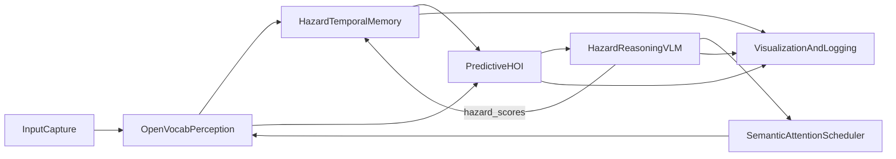
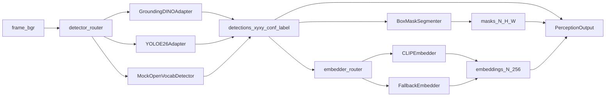
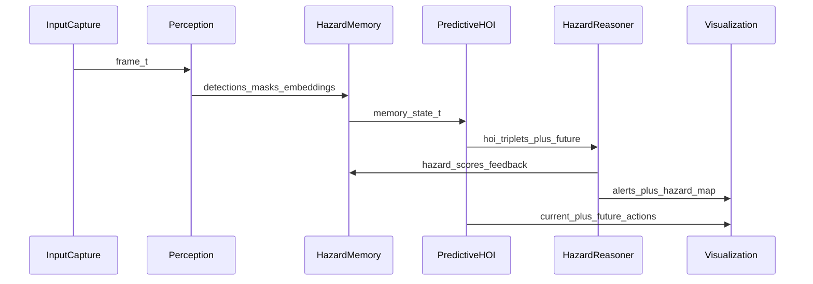
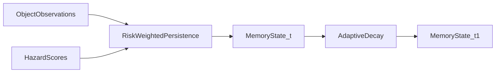
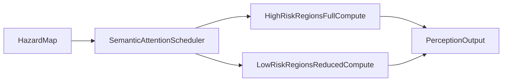

# HAPVLA Architecture

## Project Scope

HAPVLA is a modular Vision-Language-Action stack designed for laptop-class real-time inference (Apple M-series default, CUDA/TensorRT optional) and reproducible research workflows.

## What Is Novel Beyond Model Stacking

1. **Hazard-aware memory**: risk-weighted persistence where high-risk entities decay slower.
2. **Predictive HOI embeddings**: 1-3 second anticipatory HOI trajectory prediction.
3. **Semantic attention scheduler**: compute allocation favors high-risk regions for edge efficiency.
4. **New metrics**: THC (temporal HOI consistency), HAA (hazard anticipation accuracy), RME (risk-weighted memory efficiency).

## Module Graph

## Perception Backend Routing

`OpenVocabPerception` now uses a config-driven detector + embedder router while keeping a stable output contract (`detections`, `masks`, `embeddings`) for downstream modules.

### Perception Config Surface

Primary keys in `configs/default.yaml` and backend overrides:

- `perception.detector_backend`: `grounding_dino` | `yoloe26` | `mock`
- `perception.embedder_backend`: `clip` | `clip_or_fallback` | `fallback`
- `perception.detector_confidence_threshold`
- `perception.detector_text_threshold`
- `perception.detector_max_detections`
- `perception.clip_model_id`
- `perception.clip_batch_size`
- `perception.default_labels`

### Resilience/Fallback Behavior

- If detector backend initialization or inference fails, perception falls back to `MockOpenVocabDetector`.
- If CLIP embedding is unavailable, `clip_or_fallback` mode automatically switches to histogram-based fallback embeddings.
- Output shapes remain stable for downstream consumers:
  - detections: `list[Detection]`
  - masks: `(N, H, W)`
  - embeddings: `(N, 256)`

## Temporal Flow

## Memory Update Flow

## Semantic Attention Allocation

## Typed Module Contracts

Core inter-module payloads are defined in `src/hapvla/types/schema.py`:

- `FrameData`
- `Detection`
- `HOITriplet`
- `HazardScore`
- `MemoryState`

This keeps ablation swaps and backend-specific model replacements stable.

## Latency Budgets (Phase 1)

- Perception <= 50 ms/frame
- Memory <= 5 ms/frame
- HOI <= 20 ms/frame

## Logging Schema (JSONL)

Each frame record includes:

- `frame_id`, `timestamp`
- `detections`, `hois`, `hazards`
- `memory_stats`
- `latency_ms`
- `attention_allocation`
- `alerts`

Perception-only diagnostics are logged separately by:

- `scripts/run_perception_smoke.py` -> `outputs/perception_smoke.jsonl`
- `scripts/eval_perception_fps.py` -> `outputs/perception_fps.json`

