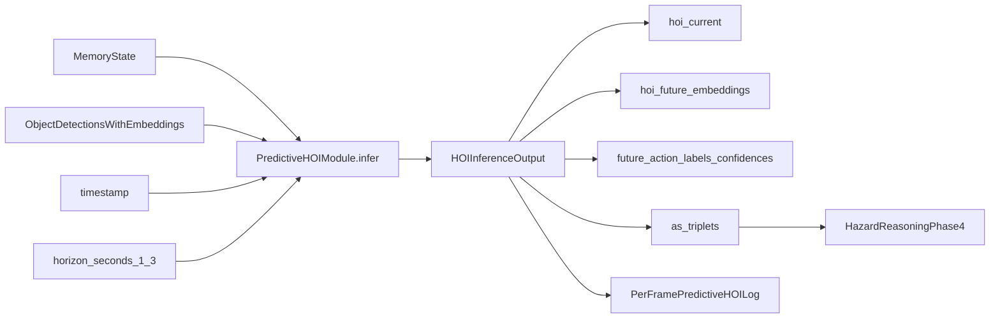

# RiskSense-VLA Modules

## Phase 3 Predictive HOI Module

This document covers Phase 3 module-level details for predictive HOI in `risksense_vla`.
Scope is limited to HOI inference/training/evaluation/test coverage and its integration boundary with hazard reasoning.

## Module Overview

Implementation files:

- `src/risksense_vla/hoi/hoi.py`
- `src/risksense_vla/hoi/datasets.py`
- `scripts/train_hoi.py`
- `scripts/run_hoi_inference.py`
- `scripts/eval_hoi.py`

Core classes:

- `PredictiveHOIModule`
- `HOIInferenceOutput`
- `PredictiveHOINet`
- `HOIGenRawDataset`
- `HICODetRawDataset`
- `TemporalHOIPreprocessedDataset`



## API Specification

### `PredictiveHOIModule.infer(...)`

Signature:

- `infer(memory_state: MemoryState, object_detections: list[PerceptionDetection], timestamp: float, horizon_seconds: int | None = None) -> HOIInferenceOutput`

Inputs:

- `memory_state`: temporal context from hazard-aware memory
- `object_detections`: frame detections with canonical `PerceptionDetection.clip_embedding`
- `timestamp`: frame time
- `horizon_seconds`: optional override clamped to `1..3`

Behavior:

- Runs ProtoHOI-style zero-shot action matching using prototype embeddings
- Fuses object embedding with `memory_state.hoi_embedding` for temporal consistency
- Produces current HOIs and short-horizon predictive embeddings
- Uses deterministic fallback embedding if `PerceptionDetection.clip_embedding` is empty

### `HOIInferenceOutput` fields

- `hoi_current: list[HOI]`
- `hoi_future_embeddings: torch.Tensor` with shape `[num_objects, horizon_seconds, emb_dim]`
- `future_action_labels: list[list[str]]`
- `future_action_confidences: torch.Tensor` with shape `[num_objects, horizon_seconds]`
- `as_triplets() -> list[HOITriplet]` for hazard integration compatibility

### Example usage

```python
from risksense_vla.hoi import PredictiveHOIModule

predictor = PredictiveHOIModule(future_horizon_seconds=3, emb_dim=256)
out = predictor.infer(
    memory_state=memory_state,
    object_detections=object_detections,
    timestamp=frame_timestamp,
)

hoi_current = out.hoi_current
hoi_future_embeddings = out.hoi_future_embeddings
future_labels = out.future_action_labels
future_conf = out.future_action_confidences
```

## Datasets and DataLoader

### Raw datasets

- `HOIGenRawDataset(annotation_json=..., action_vocab=..., emb_dim=256, horizon_seconds=3)`
- `HICODetRawDataset(annotation_json=..., action_vocab=..., emb_dim=256, horizon_seconds=3)`

Raw mode is selected in `scripts/train_hoi.py` using:

- `--dataset-mode raw`
- `--dataset-name hoigen|hico`
- `--annotation-json <path>`

### Preprocessed dataset

- `TemporalHOIPreprocessedDataset(jsonl_path=..., action_vocab=..., emb_dim=256, horizon_seconds=3)`

Preprocessed mode is selected using:

- `--dataset-mode preprocessed`
- `--preprocessed-jsonl <path>`
- optional `--val-preprocessed-jsonl <path>`

Generate temporal JSONL with:

```bash
python scripts/preprocess_hoi.py \
  --input-json data/hoi/raw_annotations.json \
  --output-jsonl data/hoi/temporal_train.jsonl \
  --window 4
```

### DataLoader helper

- `build_hoi_dataloader(dataset, batch_size=32, shuffle=True, num_workers=0)`

The emitted batch schema is compatible with `train_predictive_hoi(...)`:

- `object_embedding`
- `memory_embedding`
- `current_action_idx`
- `future_action_indices`
- `future_embeddings`

## Training and Evaluation

### Training routines (`hoi.py`)

- `train_predictive_hoi(model, train_loader, ...)`
- `evaluate_predictive_hoi(model, eval_loader, ...)`
- `save_predictive_hoi_checkpoint(path, model, action_vocab, extra=...)`
- `load_predictive_hoi_checkpoint(path, device="cpu")`

`PredictiveHOINet` learns:

- current action logits
- future action logits (1-3s)
- future embedding trajectory (1-3s)

### Scripts

Train:

```bash
python scripts/train_hoi.py --dataset-mode preprocessed --preprocessed-jsonl data/hoi/temporal_train.jsonl --output artifacts/hoi.pt
```

Run inference logging:

```bash
python scripts/run_hoi_inference.py --checkpoint artifacts/hoi.pt --log-jsonl outputs/hoi_inference.jsonl
```

Evaluate:

```bash
python scripts/eval_hoi.py --pred-log-jsonl outputs/hoi_inference.jsonl --gt-jsonl data/hoi/temporal_val.jsonl --report-json outputs/hoi_eval.json
```

### Metrics tracked

- top-1 current action accuracy
- top-1 future action accuracy by horizon (1s/2s/3s)
- future embedding cosine similarity by horizon
- FPS
- latency

## Testing and QA Coverage

Unit tests:

- `tests/unit/test_hoi_module.py`
- `tests/unit/test_hoi_predictor.py`

Smoke test:

- `tests/smoke/test_realtime_pipeline.py` (`test_smoke_predictive_hoi_infer`)

Coverage includes:

- datatype contracts
- tensor shape consistency
- empty-input behavior
- temporal coherence across sequential frames
- train/eval sanity path

Recommended test run:

```bash
python3 -m pytest tests/unit/test_hoi_module.py tests/unit/test_hoi_predictor.py tests/smoke/test_realtime_pipeline.py
```

## Phase 3 Objective Alignment

Phase 3 predictive HOI requirements are satisfied by the documented module:

- zero-shot HOI triplet recognition (`hoi_current`)
- 1-3 second predictive embeddings (`hoi_future_embeddings`)
- explicit `MemoryState` + canonical `PerceptionDetection` inputs
- modular API for later hazard integration (`as_triplets` bridge)
- reproducible training/eval scripts and test coverage
